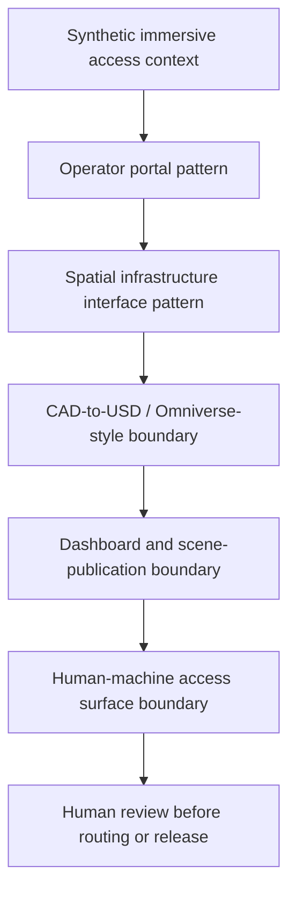

# Public-Safe Immersive Access Pattern

Status: scaffolded

## Problem Statement

Define a public-safe immersive access pattern that shows how operator portals, spatial infrastructure interfaces, CAD-to-USD / Omniverse-style notes, dashboards, scenes, and human-machine access surfaces can be reviewed without exposing deployed portals, production dashboards, live telemetry, private CAD, real facility layouts, private topology, credentials, customer assets, live access workflows, private telemetry, or sealed geometry.

## Synthetic Immersive Access Context

The example is a synthetic review environment for a mock infrastructure scene. It uses placeholder zones, mock operator states, and public-safe scene categories. It has no deployed portal, production dashboard, live telemetry, production USD scene, private CAD, real facility layout, private topology, credentials, customer assets, live access workflow, private telemetry, or sealed geometry.

## Operator Portal Pattern

| Operator state | Synthetic meaning | Boundary |
| --- | --- | --- |
| Observe | Read-only mock scene inspection | No live telemetry or customer asset |
| Annotate | Public-safe notes on mock scene elements | No production dashboard or live access workflow |
| Request review | Human review checkpoint before any publication | No deployed portal or operational access |
| Hold | Boundary issue requires removal or escalation | No sealed geometry, private topology, or private CAD |

## Spatial Infrastructure Interface Pattern

The spatial interface pattern uses synthetic spaces and generalized labels:

- mock zone;
- mock asset;
- mock access surface;
- mock review state;
- mock operator note;
- mock publication hold.

The pattern is intended for scene-boundary reasoning only. It is not a real facility layout, private topology map, production dashboard, private telemetry view, or customer access surface.

## CAD-To-USD / Omniverse-Style Boundary

CAD-to-USD and Omniverse-style language is limited to public-safe workflow notes:

1. Start with synthetic source geometry.
2. Classify every scene asset as public, private, or sealed.
3. Remove any private CAD, sealed geometry, customer assets, real facility layouts, or exact private measurements.
4. Export only reviewed synthetic scene notes.
5. Run scene-publication review before any public view.

No production USD scenes, private CAD, real facility layouts, customer assets, or sealed geometry are included in this scaffold.

## Dashboard And Scene-Publication Boundary

| Surface | Public-safe posture | Held items |
| --- | --- | --- |
| Dashboard notes | Mock status cards and synthetic operator states | Production dashboards, live telemetry, credentials |
| Scene notes | Synthetic scene categories and publication policy | Production USD scenes, private CAD, sealed geometry |
| Render notes | Public-safe placeholders only | Customer assets, real facility layout, private topology |
| Publication review | Human approval before routing or release | Live access workflows, private telemetry |

## Human-Machine Access Surface Boundary

Human-machine access surfaces are documented as conceptual review states only. This scaffold does not describe live controls, security-sensitive controls, operator credentials, production dashboards, private topology, private telemetry, customer assets, or live access workflows.

## Mermaid Immersive Access Review Diagram

## Validation Questions

- Are all scene, portal, dashboard, and access examples synthetic?
- Does the artifact avoid deployed portals, production dashboards, live telemetry, live access workflows, and private telemetry?
- Does the artifact avoid production USD scenes, private CAD, real facility layouts, private topology, customer assets, and sealed geometry?
- Are CAD-to-USD / Omniverse-style notes presented as workflow boundaries rather than production scene evidence?
- Is publication blocked until human review?

## What This Proves

- Immersive access work can be framed with operator-state, spatial-interface, scene-publication, and human-machine boundary discipline.
- CAD-to-USD / Omniverse-style workflows can be discussed without exposing private CAD, production USD scenes, or sealed geometry.
- Dashboard and scene review can be separated from deployment, telemetry, and live access claims.

## What This Does Not Prove

- It does not prove deployed portals, production dashboards, live telemetry, live access workflows, or production scene availability.
- It does not expose private CAD, real facility layouts, private topology, customer assets, private telemetry, or sealed geometry.
- It does not authorize publication, routing, metadata changes, proof completion, or release.

## Public / Private / Sealed Checklist

| Check | Status |
| --- | --- |
| Status: scaffolded | yes |
| Synthetic immersive access context only | yes |
| No deployed portals or production dashboards | yes |
| No live telemetry, live access workflows, or private telemetry | yes |
| No production USD scenes, private CAD, or sealed geometry | yes |
| No real facility layouts, private topology, or customer assets | yes |
| No credentials or security-sensitive controls | yes |
| Profile routing and proof-stack routing remain planned | yes |
